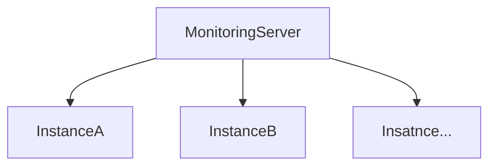

# description

> This is a multi Log Monitoring utility for in progressing a project.<br>
> There are already exist so many Monitoring tools,<br>
> If the scale grows of application (scale out or branching the server according to each function(service))<br>
> You will need to install the agent to monitor for each branched server <br><br>
> But.. Multi monitoring utility can monitor without installing agents on the server to monitor<br>
> just adding only instance's information of the server to the configuration file




# prerequisite 
> If the monitored server and monitoring server are different instance,
> You must allow port 22 on monitored server from the monitoring server.

# getting started
### Unzip the archive file(tar)

### You need to write a configuration file.
```shell
$vi ${projectDir}/conf/application.yml
```
### detail configuration
```yaml
  # List keywords to be detected in array. 
  notiKeywords:
    - ERROR

  # write the SMTP information
  mail:
    host: stmp.gmail.com 
    port: 587
    account: account
    password: password 
    from: sender@gmail.com

    # write a receiving list in array form. 
    to:
      - receiver@gmail.com


  # write servers to monitor in array form.
  servers:
    ## instance name (alias)
    - name: production-scheduler 
      host: hostAddr
      remoteAccnt: ec2-user 
      logPath: /scheduler/logs/scheduler.log
      port: 22

      # You have to decide on one(😱only one😱) authentication method. (password or authentication key)
      # if you want to use password you have to uncomment 
      # password: blabla 
      authKeyPath: /home/ec2-user/blabla.pem
```
### execute startup.sh 
> If you have completed all the settings above, you can execute monitoring process
```shell
$ sh ${projectDir}/bin/startup.sh
```